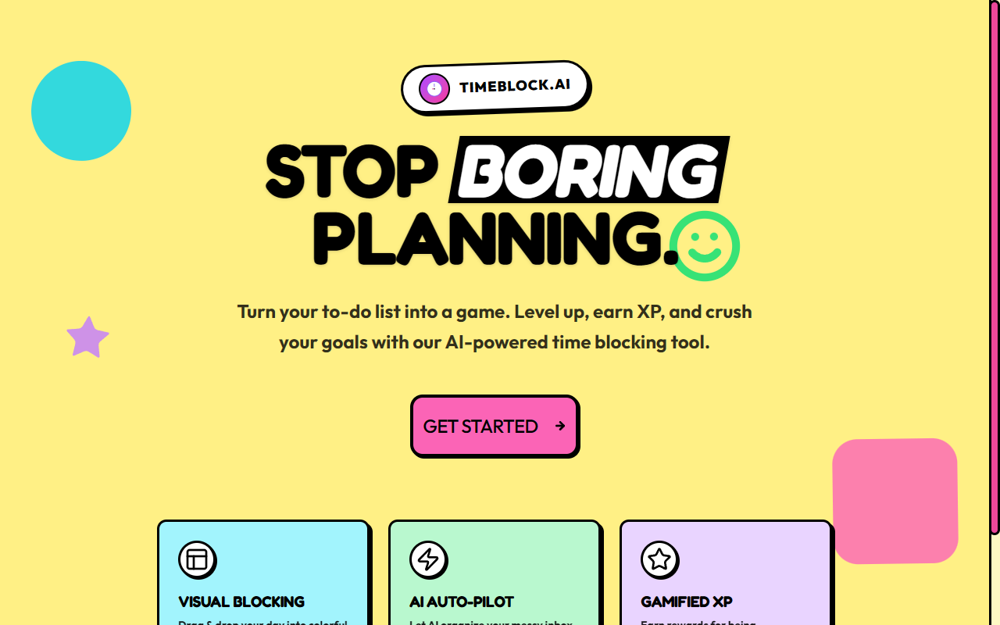
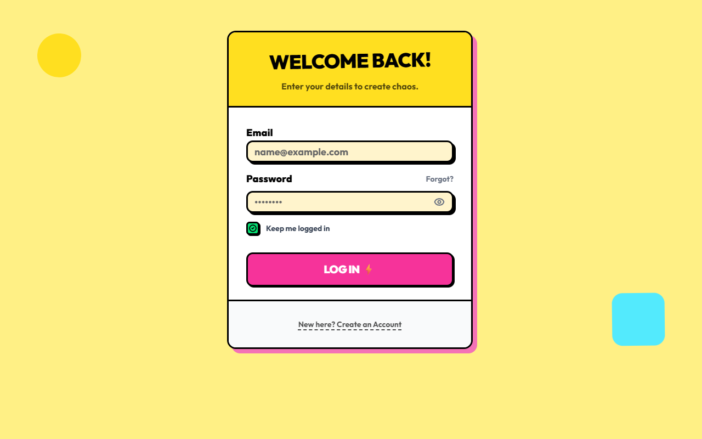
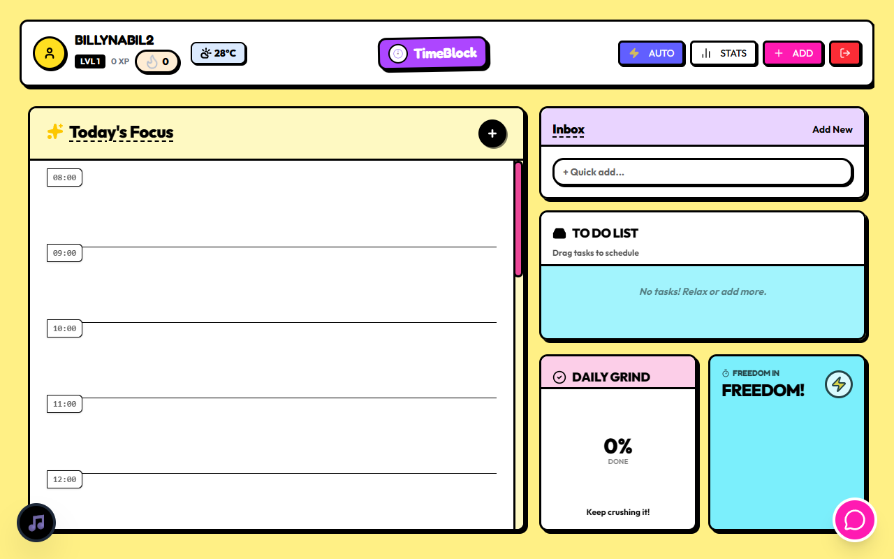

<div align="center">

# ⏰ TimeBlock.ai

### Stop Boring Planning. Start Winning Your Day.

[](https://github.com/BillyNabil/timeblock-ai/releases)
[](LICENSE)
[](https://nextjs.org)

**Turn your to-do list into a game. Level up, earn XP, and crush your goals with our AI-powered time blocking tool.**

[Download for Windows](https://github.com/BillyNabil/timeblock-ai/releases/latest) • [Live Demo](#) • [Report Bug](https://github.com/BillyNabil/timeblock-ai/issues)

</div>

---

## 📸 Screenshots

<div align="center">

### Landing Page


### Login Screen


### Dashboard


</div>

---

## ✨ Features

| Feature | Description |
|---------|-------------|
| 🎯 **Visual Time Blocking** | Drag & drop your tasks into colorful time blocks |
| 🤖 **AI Auto-Schedule** | Let Gemini AI organize your messy inbox instantly |
| 🔥 **Streak Tracking** | Build habits with daily streak tracking |
| ⭐ **Gamified XP System** | Earn rewards and level up for being productive |
| 🎯 **Focus Mode** | Pomodoro-style timer with ambient sounds |
| 💬 **AI Chat Assistant** | Get productivity tips from your AI buddy |
| 📊 **Statistics** | Track your productivity with beautiful charts |

---

## 🛠️ Tech Stack

- **Framework:** Next.js 16 (App Router)
- **Language:** TypeScript
- **Styling:** Tailwind CSS
- **UI Components:** Radix UI + shadcn/ui
- **Drag & Drop:** @dnd-kit
- **AI:** Google Gemini API
- **Database:** Supabase
- **Desktop:** Electron
- **Animations:** Framer Motion

---

## 🚀 Getting Started

### Prerequisites

- Node.js 18+
- npm or yarn
- Supabase account
- Google Gemini API key

### Installation

1. **Clone the repository**
   ```bash
   git clone https://github.com/BillyNabil/timeblock-ai.git
   cd timeblock-ai
   ```

2. **Install dependencies**
   ```bash
   npm install
   ```

3. **Set up environment variables**
   ```bash
   cp env.example .env.local
   ```
   
   Fill in your credentials:
   ```env
   NEXT_PUBLIC_SUPABASE_URL=your_supabase_url
   NEXT_PUBLIC_SUPABASE_ANON_KEY=your_supabase_anon_key
   GEMINI_API_KEY=your_gemini_api_key
   ```

4. **Set up the database**
   
   Run the SQL scripts in your Supabase SQL editor:
   - `supabase_schema.sql`
   - `add_color_to_tasks.sql`
   - `add_profiles_xp.sql`
   - `add_streaks_metadata.sql`

5. **Run the development server**
   ```bash
   npm run dev
   ```

6. **Open [http://localhost:3000](http://localhost:3000)**

### Building Desktop App

```bash
# Build for Windows
npm run dist

# Output will be in the `dist` folder
```

---

## 📁 Project Structure

```
timeblock-ai/
├── app/                    # Next.js app directory
│   ├── api/               # API routes
│   │   ├── auto-schedule/ # AI scheduling endpoint
│   │   └── chat/          # AI chat endpoint
│   ├── globals.css        # Global styles
│   ├── layout.tsx         # Root layout
│   └── page.tsx           # Main page
├── components/            # React components
│   ├── ui/               # shadcn/ui components
│   ├── TimeBlockingApp.tsx
│   ├── DraggableTask.tsx
│   ├── DroppableSlot.tsx
│   └── ...
├── lib/                   # Utility functions
│   ├── ai.ts             # AI helpers
│   ├── gemini.ts         # Gemini API client
│   └── supabaseClient.ts # Supabase client
├── types/                 # TypeScript types
├── public/               # Static assets
└── screenshots/          # App screenshots
```

---

## 🎮 How to Use

1. **Create an account** or log in
2. **Add tasks** using the quick add or full modal
3. **Drag tasks** from the backlog to time slots
4. **Use AI Auto-Schedule** to let AI organize your day
5. **Complete tasks** to earn XP and maintain your streak
6. **Check stats** to see your productivity trends

---

## 🤝 Contributing

Contributions are welcome! Feel free to:

1. Fork the repository
2. Create a feature branch (`git checkout -b feature/amazing-feature`)
3. Commit your changes (`git commit -m 'Add amazing feature'`)
4. Push to the branch (`git push origin feature/amazing-feature`)
5. Open a Pull Request

---

## 📄 License

This project is licensed under the MIT License - see the [LICENSE](LICENSE) file for details.

---

<div align="center">

**Made with ❤️ and lots of ☕ by [Billy](https://github.com/BillyNabil)**

⭐ Star this repo if you find it helpful!

</div>
